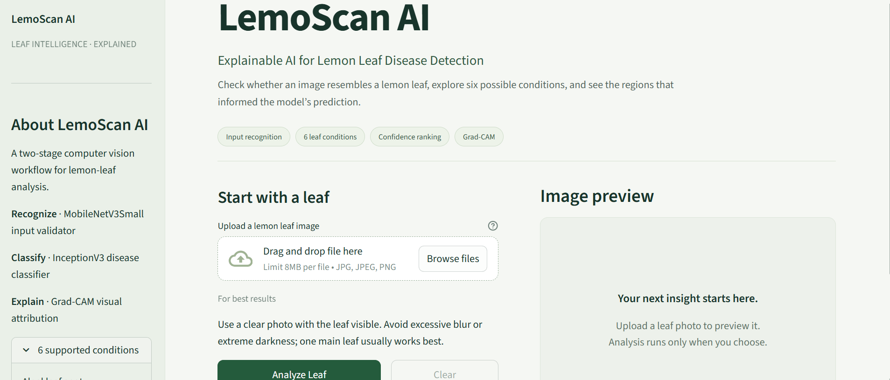
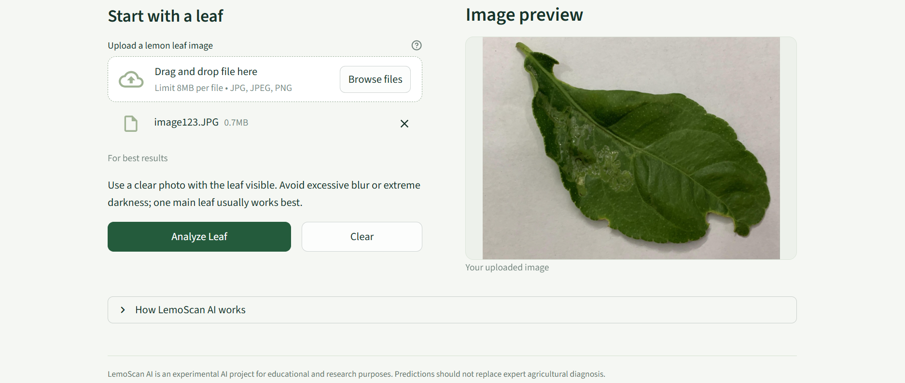
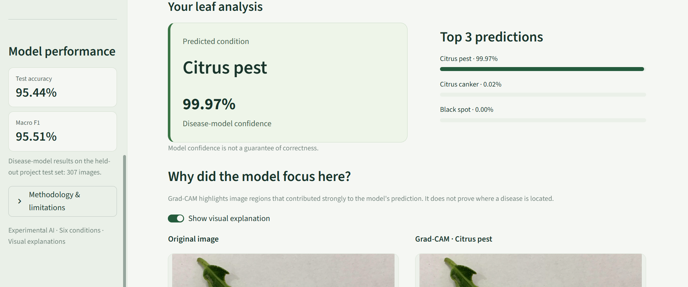
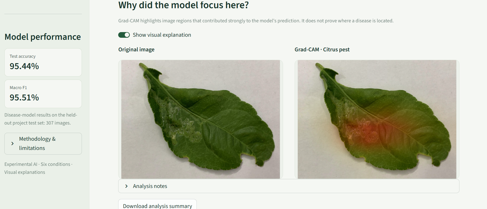
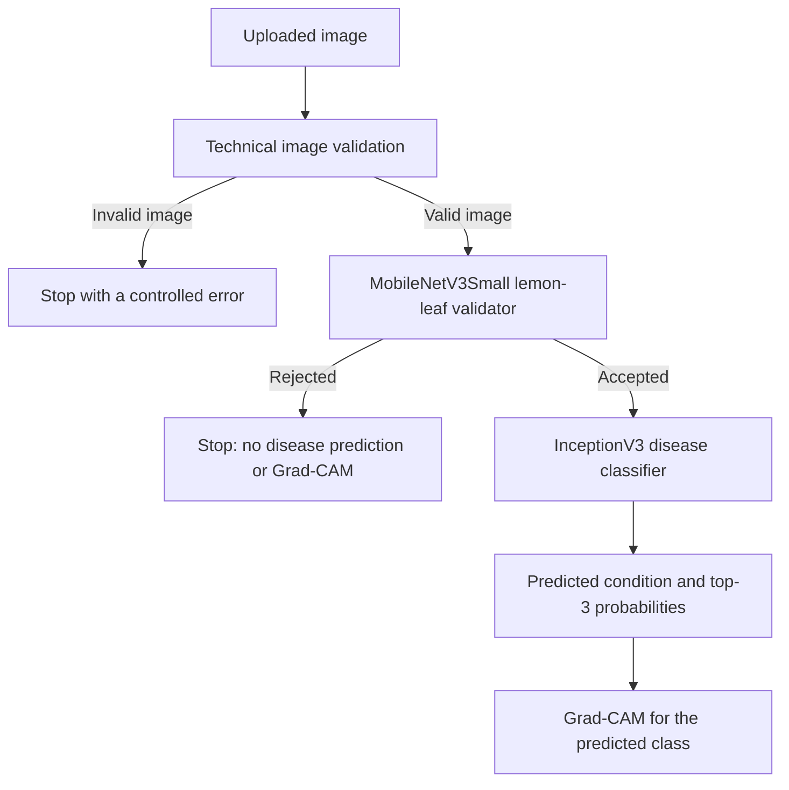

# LemoScan AI
### Explainable AI for Lemon Leaf Disease Detection

LemoScan AI first checks whether an uploaded image resembles a lemon leaf, then classifies accepted images into six disease/healthy conditions. It returns confidence-ranked predictions and a Grad-CAM visual explanation through an interactive Streamlit app. The project covers dataset auditing, leakage analysis, transfer learning, final evaluation, shared inference and deployment.

**[Open Live Demo](https://lemoscan-ai.streamlit.app/)** - **95.44% disease-model test accuracy** - **95.51% macro F1**

## Application Preview

<table>
  <tr>
    <td width="50%"><br><strong>Upload interface</strong> - a guided entry point for leaf analysis.</td>
    <td width="50%"><br><strong>Image preview</strong> - inspect the uploaded photo before analysis.</td>
  </tr>
  <tr>
    <td width="50%"><br><strong>Disease analysis</strong> - predicted condition, confidence and top-3 results.</td>
    <td width="50%"><br><strong>Visual explanation</strong> - original image beside its Grad-CAM overlay.</td>
  </tr>
</table>

## Why Two Models?

A closed-set disease classifier can assign high confidence to an invalid input because it must choose among its known classes. During development, a synthetic solid-green image passed the previous heuristic screening and received an extremely confident disease prediction. This motivated a separate learned input validator before disease classification.

## System Architecture



| Model | Purpose | Input |
| --- | --- | --- |
| MobileNetV3Small | Binary **Lemon leaf / Not lemon leaf** validation | 224 x 224 RGB |
| InceptionV3 | Six-class disease/healthy classification | 299 x 299 RGB |

These are separate models. **Not lemon leaf is not a seventh disease class.** The Streamlit interface calls the shared [`analyze_image`](utils/prediction.py) pipeline, which handles validation, classification and explanation failures separately.

## Dataset & Supported Conditions

The disease dataset contains **2,050 images across six classes**. The final group-aware split is approximately 70% training, 15% validation and 15% test.

| Condition | Train | Validation | Test |
| --- | ---: | ---: | ---: |
| Algal leaf spot | 217 | 46 | 47 |
| Black spot | 231 | 50 | 49 |
| Citrus canker | 259 | 55 | 56 |
| Citrus pest | 273 | 59 | 58 |
| Greening | 245 | 53 | 52 |
| Healthy leaf | 210 | 45 | 45 |
| **Total** | **1,435** | **308** | **307** |

The [`final_split_manifest.csv`](reports/final_split/final_split_manifest.csv) records image paths, classes, source groups and assignments; training reads from this manifest. The source `dataset/` directory is excluded by `.gitignore`; a clone should not be assumed to include its images. Source images are not required to run inference with the provided models.

### Data Integrity & Leakage Control

- Audited all 2,050 images and checked image integrity.
- Used SHA-256 for exact duplicate detection, plus dHash, pHash and additional image-similarity evidence.
- Created a manual review workflow for ambiguous pairs and preserved existing review decisions.
- Grouped exact duplicates, strong visual relationships and confirmed same-source images before splitting.
- Assigned entire groups using a deterministic, group-aware split with **seed 42**, without using original split identity as an assignment feature.

The final manifest contains **2,028 source groups**, with a **largest group of 4 images**. Every image appears exactly once. All enforced source-group, exact-duplicate, strong visual and SAME_SOURCE leakage checks returned **zero cross-split violations**. This verifies the enforced relationships; unresolved candidates remain as described under [Limitations](#limitations).

Evidence: [`split_summary.json`](reports/final_split/split_summary.json).

## InceptionV3 Training Strategy

The disease model uses an **ImageNet-pretrained InceptionV3** backbone and 299 x 299 RGB inputs with InceptionV3 preprocessing. Mild augmentation includes horizontal flips, small rotations, zoom, translation and contrast changes.

1. **Frozen feature extraction:** train the classification head with the backbone frozen, starting at learning rate `1e-3`.
2. **Controlled fine-tuning:** unfreeze selected layers after `mixed9`, keep BatchNormalization layers frozen, and start at `1e-5`.
3. **Checkpoint selection:** use EarlyStopping, ReduceLROnPlateau and ModelCheckpoint, retaining the lowest validation-loss checkpoint across both phases. Dropout and L2 regularization provide additional overfitting control.

Later fine-tuning showed mild overfitting, so **fine-tuning epoch 12 (global epoch 37)** was retained instead of the last epoch. Overfitting was monitored and controlled, not assumed eliminated.

Evidence: [`training_summary.json`](reports/inceptionv3_training/training_summary.json).

## Final Disease-Model Results

Validation supported model development and checkpoint selection. The **untouched test set was evaluated only after model development and checkpoint selection were frozen**, with one recorded final inference pass. These are disease-classifier results on lemon-leaf images, not universal end-to-end input-recognition accuracy.

| Metric | Validation - 308 images | Final test - 307 images |
| --- | ---: | ---: |
| Accuracy | 95.78% | **95.4397%** |
| Loss | 0.1367 | 0.136189 |
| Macro precision | -- | 95.6446% |
| Macro recall | -- | 95.5807% |
| Macro F1 | 95.86% | **95.5074%** |
| Weighted F1 | -- | 95.3876% |

The final test produced **293 correct and 14 incorrect predictions**. Healthy leaf achieved **97.78% F1**. The largest observed confusion was **Citrus canker -> Citrus pest**, affecting four test images. Reported loss includes model regularization.

Evidence: [validation metrics](reports/inceptionv3_training/validation_metrics.json), [test metrics](reports/inceptionv3_test/test_metrics.json), [final evaluation summary](reports/inceptionv3_test/final_evaluation_summary.json).

## Dedicated Input Validator

The **MobileNetV3Small** binary validator was trained on a constructed benchmark containing:

| Benchmark component | Images |
| --- | ---: |
| Positive: lemon leaves | 2,050 |
| Negative: bean leaves | 1,000 |
| Negative: generic objects | 1,000 |
| Negative: synthetic robustness images | 50 |

The frozen acceptance rule is `lemon_probability >= 0.397647500038147`. Threshold selection used **validation data only**, before final test evaluation.

| Constructed benchmark | Accuracy | False accepts | False rejects |
| --- | ---: | ---: | ---: |
| Validation - 616 images | 100% | 0 | 0 |
| Final test - 614 images | 100% | 0 | 0 |

**The validator achieved 100% on the constructed benchmark used in this project; broader plant-species and real-world generalization remains unverified.** The previous solid-green failure case is now correctly rejected. Bean and object source domains differ from the lemon-leaf dataset, which limits interpretation of this result.

Evidence: [`validator_summary.json`](reports/leaf_validator/validator_summary.json), [`test_metrics.json`](reports/leaf_validator/test_metrics.json).

## Grad-CAM & Shared Inference

**Grad-CAM highlights regions that contributed strongly to the model prediction.** It runs only after the lemon-leaf gate accepts an input and disease classification succeeds.

The implementation uses InceptionV3 `mixed10` feature maps and targets the exact class index already predicted by the classifier. Prediction and explanation share the same decoded image and prepared disease-model input, avoiding inconsistent preprocessing. If explanation generation fails, the successful prediction remains available with an explanation-unavailable message. Attribution does not prove disease localization.

Implementation: [`preprocessing.py`](utils/preprocessing.py), [`prediction.py`](utils/prediction.py), [`xai.py`](utils/xai.py).

## Experiment & Engineering Workflow

| Notebook | Purpose |
| --- | --- |
| [00_dataset_audit.ipynb](notebooks/00_dataset_audit.ipynb) | Inventory images, check integrity and identify potential duplicates. |
| [01_duplicate_review_and_grouping.ipynb](notebooks/01_duplicate_review_and_grouping.ipynb) | Review duplicate evidence and build visual/source groups. |
| [02_manual_similarity_review.ipynb](notebooks/02_manual_similarity_review.ipynb) | Review ambiguous similarity pairs and preserve decisions. |
| [03_leakage_resistant_split.ipynb](notebooks/03_leakage_resistant_split.ipynb) | Generate and verify deterministic group-aware assignments. |
| [04_inceptionv3_training.ipynb](notebooks/04_inceptionv3_training.ipynb) | Run transfer learning, controlled fine-tuning and validation-based selection. |
| [05_final_test_evaluation.ipynb](notebooks/05_final_test_evaluation.ipynb) | Evaluate the frozen disease checkpoint on the held-out test set. |
| [06_lemon_leaf_validator.ipynb](notebooks/06_lemon_leaf_validator.ipynb) | Build the binary benchmark, train the gate and freeze its threshold. |

## Tech Stack

| Area | Technologies |
| --- | --- |
| Runtime | Python 3.13, TensorFlow, Keras |
| Models | InceptionV3, MobileNetV3Small |
| Image processing | NumPy, Pillow |
| Explainability | Grad-CAM |
| Interface & hosting | Streamlit, Streamlit Community Cloud |
| Experiments | Jupyter notebooks |
| Versioning & artifacts | Git, Git LFS |

## Project Structure

```text
LemoScan-AI/
|-- assets/              # Application screenshots
|-- model/               # Keras model artifacts and inference metadata
|-- notebooks/           # Audit, split, training and evaluation workflow
|-- reports/             # Saved audit evidence, metrics and verification
|-- scripts/             # Engineering utilities and smoke checks
|-- training/            # Class mappings and historical training material
|-- utils/               # Shared validation, loading, prediction and Grad-CAM
|-- .streamlit/          # Streamlit configuration
|-- streamlit_app.py     # Active application entrypoint
`-- requirements.txt     # Pinned deployment/runtime dependencies
```

The active disease artifact is [`model/inceptionv3_best_model.keras`](model/inceptionv3_best_model.keras); the gate is [`model/lemon_leaf_validator.keras`](model/lemon_leaf_validator.keras). Older ResNet50 material is retained as prototype history, not the active system.

## Local Setup

Use **Python 3.13** and install Git LFS before retrieving model artifacts.

```bash
git lfs install
git clone https://github.com/Shamma-Samiha/LemoScan-AI.git
cd LemoScan-AI
git lfs pull
python -m venv .venv
```

Activate the environment on Windows PowerShell:

```powershell
.\.venv\Scripts\Activate.ps1
```

Or on Linux/macOS:

```bash
source .venv/bin/activate
```

Install the runtime dependencies and launch:

```bash
python -m pip install -r requirements.txt
python -m streamlit run streamlit_app.py
```

Open `http://localhost:8501`. The root requirements file targets application deployment; reproducing notebooks also requires their experiment dependencies and access to the source images. Keep the model metadata and class-mapping files in their repository locations.

## Usage

1. Upload a JPG, JPEG or PNG image.
2. Inspect the preview; use a clear photo with the leaf visible.
3. Click **Analyze Leaf**.
4. The validator checks whether the image resembles a lemon leaf.
5. Accepted inputs receive disease analysis.
6. Review the predicted condition, confidence, top-3 probabilities and Grad-CAM explanation.

Rejected non-lemon inputs do not run disease classification or Grad-CAM. Repeated interface reruns reuse the current upload's result.

## Deployment

**Live application: [lemoscan-ai.streamlit.app](https://lemoscan-ai.streamlit.app/)**

Hosted on **Streamlit Community Cloud**, with Python 3.13 as the deployment target. Models load lazily into shared process caches; current-upload results are retained per session. Keras artifacts use **Git LFS**, and runtime paths resolve relative to the repository.

## Key Engineering Improvements

- Replaced unreliable color-based semantic screening with a learned binary validator.
- Added integrity auditing, leakage-aware grouping and deterministic group-aware splitting.
- Progressed from the ResNet50 prototype to a fine-tuned InceptionV3 disease model.
- Retained the best checkpoint to control later overfitting and separated test evaluation from model selection.
- Unified prediction and Grad-CAM preprocessing and explicitly targeted the predicted class.
- Built failure-tolerant shared inference utilities and deployed an interactive explainable-AI interface.

## Limitations

- The validator's broader real-world and plant-species generalization has not been established.
- **410 unresolved Category C/D similarity candidate pairs cross the final split.** They were not treated as proven same-source relationships; complete biological-source independence is therefore not established.
- Confidence values are model probabilities, not guarantees of correctness. The disease uncertainty rule remains provisional and uncalibrated.
- Grad-CAM is attribution, not causal proof or verified disease localization.
- This system is for educational and research use and should not replace agricultural expert diagnosis.
