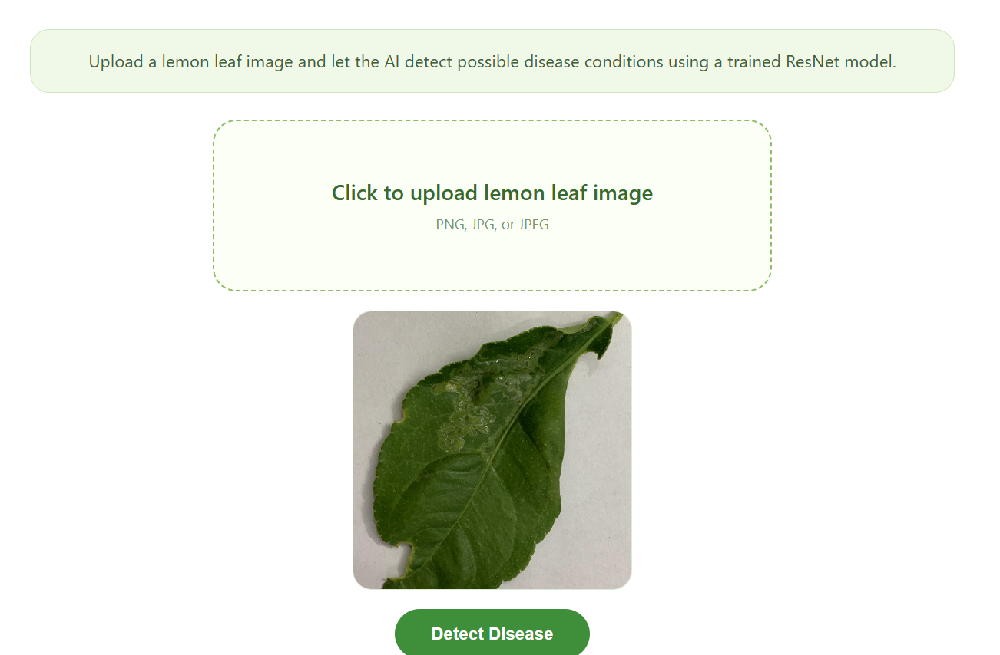

# LemoScan AI

An explainable AI web application for lemon leaf disease detection. LemoScan AI lets a user upload a lemon leaf image, runs a trained ResNet-based classifier, and returns a disease prediction with confidence scores and a Grad-CAM visual explanation.



## Website View

The interface is designed as a simple, focused diagnosis workflow: upload a clear lemon leaf photo, submit it for analysis, and review the model output with supporting evidence.


## What It Detects

The active model is configured to classify lemon leaf images into:

- Algal leaf spot
- Black spot
- Citrus canker
- Citrus pest
- Greening
- Healthy leaf

If the uploaded image does not look like a lemon leaf, or if the model is not confident enough, the app returns a warning instead of presenting an unreliable disease call.

## Key Features

- Clean Flask web interface with image upload and preview
- Trained ResNet50 model loaded from `model/resnet_best_model.keras`
- Lemon-leaf validation before classification
- Top prediction with confidence score
- Top three class matches for more transparent output
- Grad-CAM heatmap generation to highlight influential image regions
- Friendly uncertainty handling for low-confidence predictions
- Lightweight project structure for local demos and deployment

## Tech Stack

- Python
- Flask
- TensorFlow / Keras
- NumPy
- Pillow
- HTML, CSS, JavaScript

## Project Structure

```text
LemoScan-AI/
|-- app.py
|-- model/
|   `-- resnet_best_model.keras
|-- static/
|   |-- css/
|   |-- js/
|   |-- results/
|   `-- uploads/
|-- templates/
|   |-- index.html
|   `-- result.html
|-- training/
|   `-- class_indices.json
|-- utils/
|   |-- model_loader.py
|   |-- prediction.py
|   `-- xai.py
`-- assets/
    |-- LemoScan1.png
    `-- LemoScan 2.png
```

## How It Works

1. The user uploads a PNG, JPG, or JPEG image.
2. The app checks whether the image is likely to contain a lemon leaf.
3. The image is resized and preprocessed for the active model architecture.
4. The trained model predicts the most likely disease class.
5. The result page displays the predicted class, confidence score, top matches, and optional warning.
6. For valid confident predictions, Grad-CAM highlights the regions that influenced the model decision.

## Run Locally

Clone the project, install the dependencies, and start the Flask app:

```bash
pip install -r requirements.txt
pip install flask werkzeug
python app.py
```

Then open:

```text
http://127.0.0.1:5000
```

## Model Configuration

The app loads model metadata through `utils/model_loader.py`. If no custom metadata file is provided, it falls back to:

```text
Architecture: ResNet50
Model path: model/resnet_best_model.keras
Class index path: training/class_indices.json
Image size: 224 x 224
```

You can override the model metadata path with the `LEMOSCAN_MODEL_METADATA` environment variable.

## Important Note

LemoScan AI is an AI-assisted plant disease screening tool. Its predictions should be used as guidance only and should not replace expert agricultural diagnosis, field inspection, or laboratory testing.
